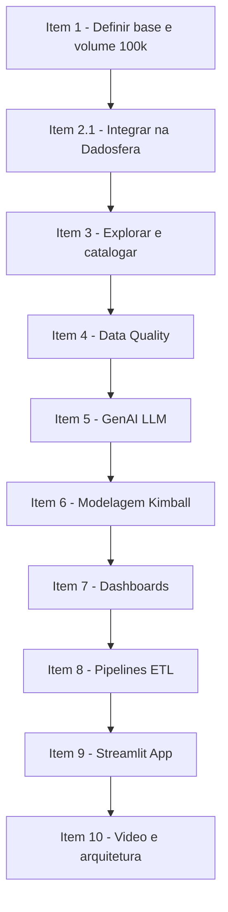

# Item 0 — Agilidade e Planejamento (PMBOK)

## 0.1 Objetivo
Planejar e representar todas as etapas do projeto (da concepção à implementação), com boas práticas de PMBOK, incluindo dependências, riscos, custos e pontos críticos.

---

## 0.2 Escopo (alto nível)
**Entrega do case (end-to-end):**
- Ingestão e integração de dados (>= 100k registros)
- Catalogação e organização em camadas (Data Lake)
- Data Quality (relatório automatizado)
- Processamento de texto com GenAI/LLM (features estruturadas)
- Modelagem dimensional (Kimball) com 2 visões finais
- Dashboards (categorias + série temporal + 5 visualizações)
- Pipeline automatizado (ETL)
- Data App em Streamlit (deploy)
- Apresentação final (vídeo) propondo substituição parcial/total da arquitetura atual

---

## 0.3 Artefato de Planejamento (Fluxo + Dependências)

---

## 0.4 Kanban (visão de execução)

| To Do | Doing | Done |
|------|-------|------|
| Integrar dados |  | Feito |
| Catalogar ativos |  | Feito |
| Data Quality |  | Feito |
| Features com LLM |  | Feito |
| Modelagem Kimball |  | Feito |
| Dashboards |  |Feito |
| Pipelines |  | Feito |
| Streamlit App |  | Feito |
| Vídeo final |  | Feito |

---

## 0.5 Análise de Riscos (PMBOK)

| Risco | Prob. | Impacto | Mitigação | Evidência |
|------|------|---------|----------|----------|
| Não atingir 100k registros | Média | Alto | Gerar transações sintéticas (order_items 500k) | Print da contagem na Dadosfera |
| Dados inconsistentes (nulos, datas inválidas) | Alta | Alto | Great Expectations com suites por tabela | Relatório + prints |
| LLM gerar JSON inválido | Média | Médio | Validar com schema + fallback (regex/heurística) | Amostra validada |
| Tempo curto para dashboards/app | Média | Alto | Priorizar MVP: 5 visuais + app de similaridade | Dashboard + app publicado |
| Custos / limitações de ambiente | Baixa | Médio | Usar Colab + Streamlit Community Cloud | Links e reprodutibilidade |

---

## 0.6 Estimativa de Custos (alto nível)

| Componente | Opção | Custo estimado |
|----------|-------|----------------|
| Desenvolvimento Python/LLM | Google Colab | 0 |
| Data App | Streamlit Community Cloud | 0 |
| Plataforma de Dados | Dadosfera (ambiente de treino) | fornecido |
| Repositório | GitHub | 0 |

---

## 0.7 Recursos e papéis

- **Eu (Data Specialist):** ingestão, modelagem, qualidade, BI, app, apresentação
- **Dadosfera:** plataforma (catálogo, visualização, pipelines, IAM)
