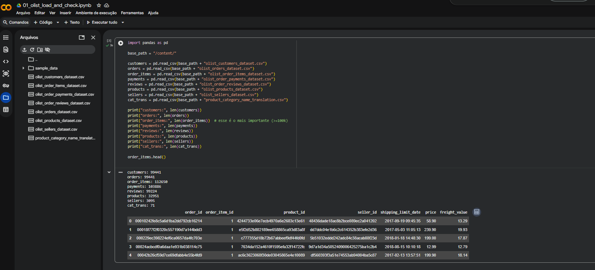

# Item 1 — Sobre a Base de Dados

## 1.1 Dataset escolhido
Utilizei o **Olist E-commerce Dataset**, um dataset público e real de e-commerce, pois permite executar o case ponta a ponta:
- Dados transacionais (pedidos, itens, pagamentos)
- Dimensão de produtos e categorias
- Série temporal (timestamps de compra e logística)
- Texto desestruturado (reviews) para GenAI/LLMs e criação de features

## 1.2 Arquivos utilizados
**Núcleo (obrigatórios):**
- `olist_orders_dataset.csv` (série temporal e status/logística)
- `olist_order_items_dataset.csv` (tabela transacional e volume >= 100k)
- `olist_products_dataset.csv` (produtos + categoria)
- `product_category_name_translation.csv` (tradução de categorias PT→EN)
- `olist_customers_dataset.csv` (clientes/segmentação)
- `olist_order_reviews_dataset.csv` (texto desestruturado)

**Complementares (para enriquecer análises):**
- `olist_order_payments_dataset.csv` (pagamentos e valor)
- `olist_sellers_dataset.csv` (vendedores/marketplace)

## 1.3 Requisito de volume (>= 100k)
O dataset atende ao requisito mínimo do case:
- **order_items: 112.650 registros** (>= 100.000)

## 1.4 Evidência (print)

