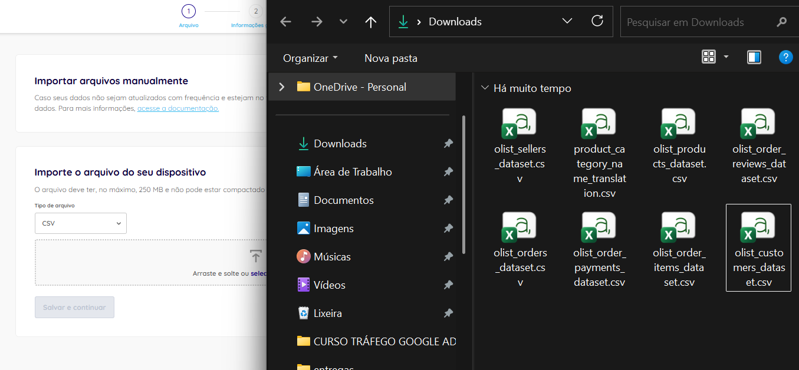
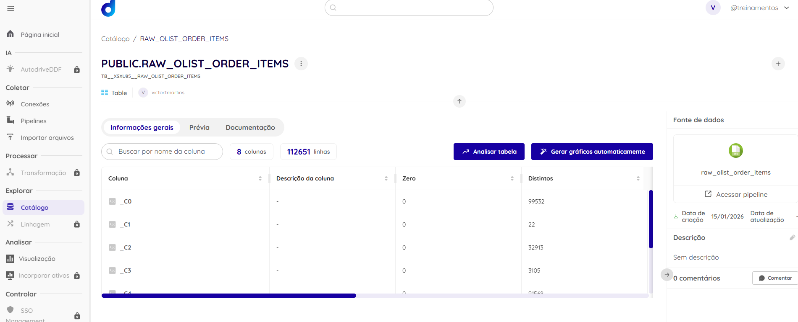
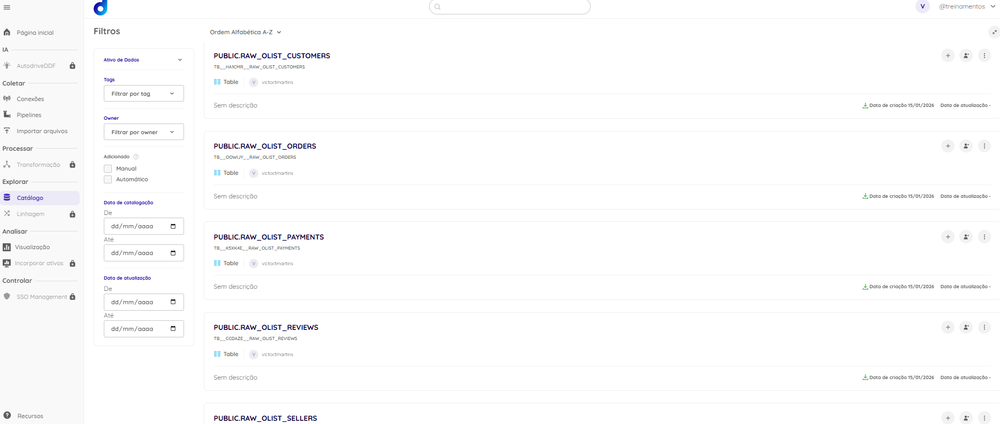

# Item 2.1 — Dadosfera: Integrar

## 2.1.1 Objetivo
Integrar o dataset escolhido na Dadosfera via módulo de importação, garantindo volume mínimo (>= 100k) e preparando os dados para catalogação e camadas do Data Lake.

## 2.1.2 Processo de Importação
Os arquivos foram importados via **Coletar → Importar arquivos**, com nomenclatura padronizada na camada **raw**.

### Datasets importados (raw)
- raw_olist_orders - https://app.dadosfera.ai/pt-BR/catalog/data-assets/74826053-b2dd-4750-8532-cea1b112024d
- raw_olist_order_items - https://app.dadosfera.ai/pt-BR/catalog/data-assets/ef9944b5-b721-43e3-8b4c-7ce6f5503ca7
- raw_olist_products - https://app.dadosfera.ai/pt-BR/catalog/data-assets/ab940340-9ddd-4e68-b2c0-c0e120b6f002
- raw_olist_customers - https://app.dadosfera.ai/pt-BR/catalog/data-assets/a97a56b4-13ce-4c93-9b44-157c376c66c6
- raw_olist_reviews - https://app.dadosfera.ai/pt-BR/catalog/data-assets/83608bcc-2d76-41b7-86c6-e92315b2acc6
- raw_olist_payments - https://app.dadosfera.ai/pt-BR/catalog/data-assets/969782a3-c1ab-4447-80ea-1b3b95d8e092
- raw_olist_sellers - https://app.dadosfera.ai/pt-BR/catalog/data-assets/7d9426b5-0459-42fc-b841-a5bf6e992865
- raw_olist_category_translation - https://app.dadosfera.ai/pt-BR/catalog/data-assets/ee4c8c3f-d1b6-46c5-b7cd-97f33a357049

## 2.1.3 Evidências (prints)
**Upload**

**Preview do dataset principal (>=100k)**

**Catálogo com assets criados**

