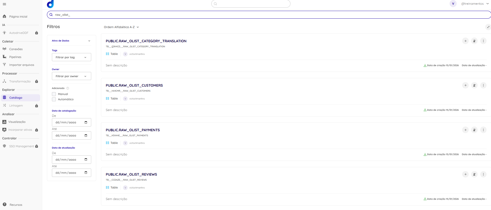
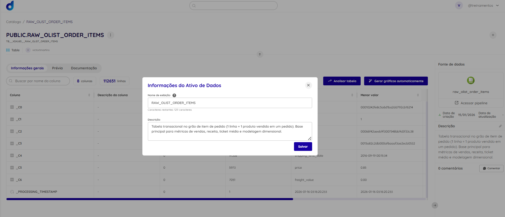
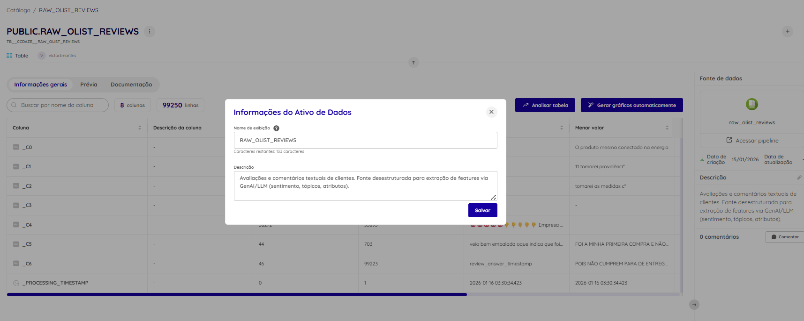

# Item 3 — Dadosfera: Explorar (Catálogo + Data Lake Zones)

## 3.1 Objetivo
Catalogar os datasets importados na Dadosfera e organizá-los seguindo boas práticas de Data Lake (camadas raw → staging → curated), com documentação e governança básica (descrição, tags, sensibilidade e uso).

## 3.2 Camadas do Data Lake (proposta)
- **Raw / Landing (já implementado):** `raw_olist_*`  
  Dados importados como recebidos (sem transformações).
- **Staging (a ser gerado nos itens 4/5):** `stg_olist_*`  
  Padronização de tipos, tratamento de nulos, deduplicação e regras de qualidade.
- **Curated (a ser gerado nos itens 6/7):** `cur_olist_*`  
  Dados prontos para consumo (BI/ML), incluindo modelagem dimensional e features extraídas de texto.

## 3.3 Datasets catalogados (Raw)
- raw_olist_orders - https://app.dadosfera.ai/pt-BR/catalog/data-assets/74826053-b2dd-4750-8532-cea1b112024d
- raw_olist_order_items - https://app.dadosfera.ai/pt-BR/catalog/data-assets/ef9944b5-b721-43e3-8b4c-7ce6f5503ca7
- raw_olist_products - https://app.dadosfera.ai/pt-BR/catalog/data-assets/ab940340-9ddd-4e68-b2c0-c0e120b6f002
- raw_olist_customers - https://app.dadosfera.ai/pt-BR/catalog/data-assets/a97a56b4-13ce-4c93-9b44-157c376c66c6
- raw_olist_reviews - https://app.dadosfera.ai/pt-BR/catalog/data-assets/83608bcc-2d76-41b7-86c6-e92315b2acc6
- raw_olist_payments - https://app.dadosfera.ai/pt-BR/catalog/data-assets/969782a3-c1ab-4447-80ea-1b3b95d8e092
- raw_olist_sellers - https://app.dadosfera.ai/pt-BR/catalog/data-assets/7d9426b5-0459-42fc-b841-a5bf6e992865
- raw_olist_category_translation - https://app.dadosfera.ai/pt-BR/catalog/data-assets/ee4c8c3f-d1b6-46c5-b7cd-97f33a357049

## 3.4 Evidências (prints)
**Lista de assets raw no catálogo**

**Exemplo de catalogação: order_items (principal)**

**Exemplo de catalogação: reviews (desestruturado)**

