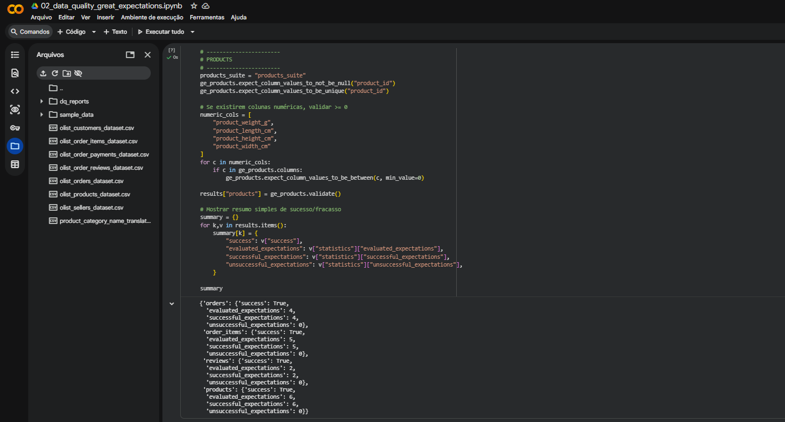
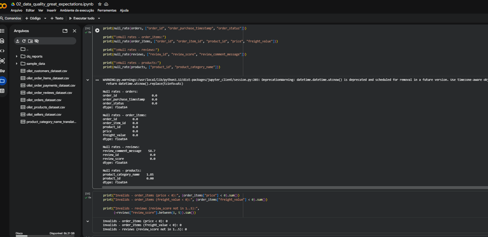

# Item 4 — Data Quality

## 4.1 Objetivo
Gerar um relatório automatizado de qualidade de dados para identificar inconsistências e dados faltantes que impactam análises, dashboards e modelos de IA.

## 4.2 Ferramenta utilizada
Utilizei **Great Expectations** para criar suites de validação por tabela, focando em:
- Integridade de chaves (não nulo / unicidade)
- Faixas de valores (ex.: preço >= 0)
- Validade de categorias (conjuntos permitidos)
- Medição de dados faltantes (null rates)

## 4.3 Principais regras aplicadas
### orders
- `order_id` não nulo e único
- `order_purchase_timestamp` não nulo
- `order_status` dentro do conjunto esperado

### order_items
- `order_id`, `product_id`, `order_item_id` não nulos
- `price` e `freight_value` >= 0

### reviews
- `review_id` não nulo
- `review_score` entre 1 e 5

### products
- `product_id` não nulo e único
- dimensões/peso >= 0 (quando existentes)

## 4.4 Evidências
- Print do resumo de validação (success/failed)
- Print de null-rates por coluna crítica
- Relatórios JSON exportados

## 4.5 Saídas
- Relatórios em `docs/data_quality_reports/` (JSON)
- Notebook Colab com execução e validações
