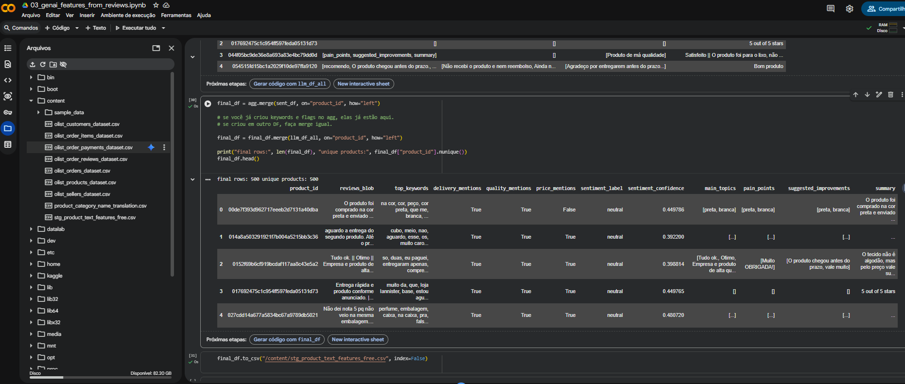
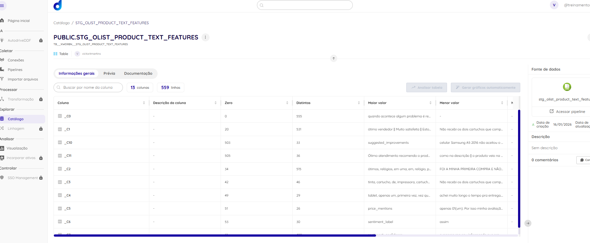
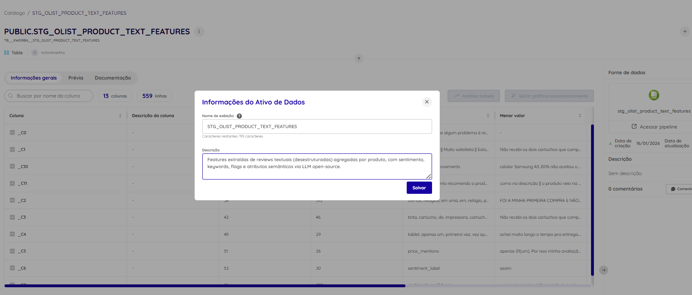

# Item 5 — GenAI/LLM: Processar (texto → features)

## 5.1 Objetivo
Transformar dados desestruturados de avaliações (reviews) em **features estruturadas** para análise e uso em BI/ML.

## 5.2 Fonte desestruturada
- Dataset: `olist_order_reviews_dataset.csv`
- Coluna principal: `review_comment_message` (texto livre)
- Vinculação ao produto: `review.order_id → order_items.order_id → product_id`

## 5.3 Estratégia (eficiência e custo)
- Para evitar custo elevado e reduzir tempo, agreguei textos por `product_id` (top 500 produtos com mais reviews).
- Extraí features em duas camadas:
  1) **Baseline NLP**: sentimento (modelo open-source), keywords (TF-IDF) e flags (qualidade/entrega/preço).
  2) **LLM open-source (Colab)**: geração de atributos semânticos em JSON (`main_topics`, `pain_points`, `suggested_improvements`, `summary`) como prova de conceito.

Essa abordagem é compatível com cenários reais: *primeiro garante features baratas e robustas, depois enriquece com LLM quando necessário*.

## 5.4 Dataset final gerado
Arquivo final:
- `stg_product_text_features_free.csv` (1 linha por produto)

Ativo na Dadosfera:
- `stg_olist_product_text_features` — **[LINK_AQUI](https://app.dadosfera.ai/pt-BR/catalog/data-assets/fa0e7670-499a-46d6-a5da-e9a977784610)**

## 5.5 Principais features geradas
- `sentiment_label`, `sentiment_confidence`
- `top_keywords`
- `delivery_mentions`, `quality_mentions`, `price_mentions`
- `main_topics`, `pain_points`, `suggested_improvements`, `summary`

## 5.6 Evidências (prints)

