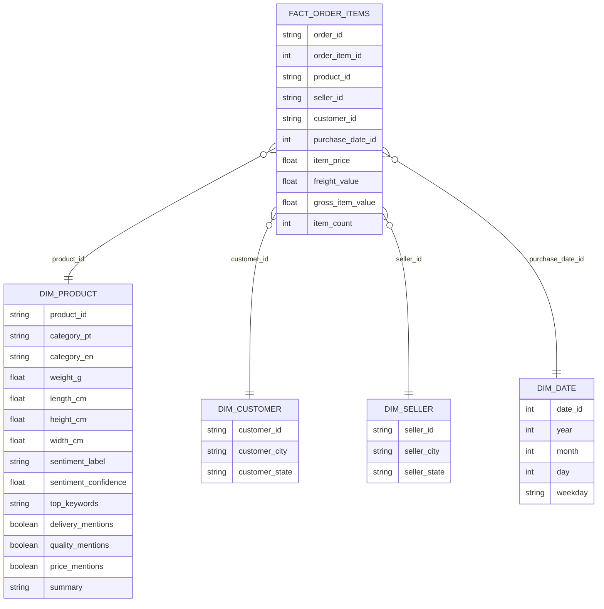

# Item 6 — Modelagem de Dados (Kimball)

## 6.1 Objetivo
Propor uma modelagem de dados consistente com um cenário de e-commerce, com foco em **análises descritivas/prescritivas** e consumo em **dashboards e aplicações**.  
A modelagem deve facilitar:
- consultas rápidas e padronizadas para BI;
- governança e reuso (mesmas dimensões para múltiplas análises);
- evolução (inclusão de features de IA/LLM como enriquecimento semântico).

---

## 6.2 Abordagem escolhida: Kimball (Star Schema)
Escolhi **Kimball (modelo dimensional)** por ser uma abordagem amplamente utilizada em DATAWAREHOUSE para BI e analytics, especialmente em ambientes transacionais como e-commerce, pois:
- simplifica o consumo por analistas/negócio (modelo intuitivo);
- melhora performance de consultas agregadas (star schema);
- permite criar “visões” finais por área (ex.: vendas, experiência do cliente) reutilizando as mesmas dimensões;
- é ideal para dashboards do Item 7 (categorias, séries temporais, comparativos).

> Alternativas como Data Vault são excelentes para histórico e rastreabilidade, porém aumentam complexidade para consumo direto em BI. Para este case (tempo + foco em geração rápida de valor), Kimball é a escolha mais eficiente.

---

## 6.3 Definição do Grão (Grain)
A decisão mais importante do modelo dimensional é o **grão** das tabelas fato.

### Fato principal (recomendado): `fact_order_items`
**Grão:** 1 linha = **1 item** dentro de um pedido (order_id + order_item_id + product_id).  
Justificativa:
- o dataset `olist_order_items_dataset` contém `price` e `freight_value`, permitindo métricas financeiras completas;
- oferece maior detalhe (nível item), permitindo análises por produto/categoria/vendedor;
- o volume é maior (>=100k), alinhado aos requisitos do case.

---

## 6.4 Zonas/Camadas do DW (visão de arquitetura lógica)
**Raw → Staging → Curated (DW/Datamarts)**

- **Raw**: dados originais do Olist (csv), sem transformação.
- **Staging (stg)**: padronização de tipos, limpeza, deduplicação, criação de colunas auxiliares.
- **Curated (cur)**: tabelas dimensionais e fatos (Kimball), prontas para consumo.
- **Consumption**: dashboards (Item 7) e Data App (Item 9).

Observação: o dataset do Item 5 (`stg_olist_product_text_features`) entra como **enriquecimento semântico** na dimensão de produto (dim_product).

---

## 6.5 Dimensões (Dimensions)

### `dim_product` (produto — enriquecida com GenAI/NLP)
**PK:** `product_id`

**Atributos transacionais (Olist):**
- `product_category_name` (PT)
- `category_en` (via `product_category_name_translation`)
- `product_weight_g`
- `product_length_cm`
- `product_height_cm`
- `product_width_cm`

**Atributos semânticos (Item 5 — features de texto):**
- `sentiment_label`, `sentiment_confidence`
- `top_keywords`
- `delivery_mentions`, `quality_mentions`, `price_mentions`
- `main_topics`, `pain_points`, `suggested_improvements`, `summary`

**Por que isso é forte:**
Essa dimensão vira um “catálogo inteligente” de produtos: além de categoria e medidas, inclui percepção do cliente extraída de texto (IA/LLM), permitindo análises ricas e ações prescritivas.

---

### `dim_customer` (cliente)
**PK:** `customer_id` *(ou `customer_unique_id` dependendo do objetivo; para este case, `customer_id` é suficiente)*  
Atributos:
- `customer_city`
- `customer_state`

---

### `dim_seller` (vendedor)
**PK:** `seller_id`  
Atributos:
- `seller_city`
- `seller_state`

---

### `dim_date` (tempo — role-playing)
**PK:** `date_id` (ex.: `YYYYMMDD`)  
Atributos:
- `year`, `month`, `day`
- `weekday`
- `week_of_year` (opcional)

**Role-playing:** a mesma dimensão pode ser usada com “papéis” diferentes:
- `purchase_date_id` (order_purchase_timestamp)
- `delivered_date_id` (order_delivered_customer_date)
- `estimated_date_id` (order_estimated_delivery_date)

---

## 6.6 Tabelas Fato (Facts)

### `fact_order_items` (fato principal)
**Chaves:**
- **Degenerate dimension:** `order_id` (mantida no fato para rastreio e drill-down)
- **PK técnica (recomendada):** (`order_id`, `order_item_id`)

**FKs:**
- `product_id` → `dim_product`
- `seller_id` → `dim_seller`
- `customer_id` → `dim_customer` *(via orders → customers)*
- `purchase_date_id` → `dim_date`  
(opcional) `delivered_date_id`, `estimated_date_id`

**Medidas (measures):**
- `item_price` (price)
- `freight_value`
- `gross_item_value = item_price + freight_value`
- `item_count = 1`

**Exemplos de métricas derivadas:**
- receita por categoria/mês/estado
- frete médio por categoria
- top produtos por receita e volume

---

### `fact_orders` (fato complementar / visão operacional)
**PK:** `order_id`  
**FKs:**
- `customer_id`
- `purchase_date_id`
- `delivered_date_id`
- `estimated_date_id`

**Atributos/medidas:**
- `order_status`
- `order_value` (soma de item_price por order_id)
- `delivery_days = delivered - purchase`
- `is_delayed = delivered > estimated`

---

## 6.7 Duas Visões Finais (exigência do item)

### Visão Final A — Vendas & Operação (Comercial)
**Objetivo:** entender desempenho de vendas, logística e distribuição.
Principais perguntas:
- Qual a receita por mês e por categoria?
- Quais categorias têm maior frete médio?
- Quem são os top sellers por receita?
- Quais estados/cidades concentram vendas?

**Tabelas:**
- `fact_order_items`
- `dim_product`, `dim_date`, `dim_customer`, `dim_seller`

---

### Visão Final B — Experiência do Cliente (Reviews + IA/LLM)
**Objetivo:** relacionar performance e percepção do cliente.
Principais perguntas:
- Quais categorias têm maior volume de “pain_points”?
- Quais produtos têm sentimento mais negativo?
- Menções a entrega (delivery_mentions) estão associadas a atraso?
- Quais melhorias são mais sugeridas por categoria?

**Tabelas:**
- `dim_product` enriquecida (Item 5)
- `fact_orders`/`fact_order_items`
- `dim_date`

---

## 6.8 Diagrama (Star Schema) — Mermaid
> Diagrama ER simplificado para visualização do modelo dimensional.

