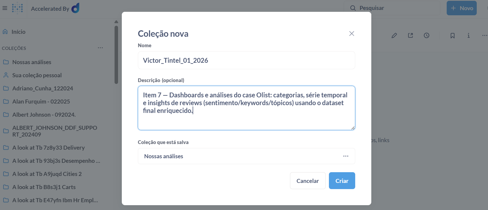
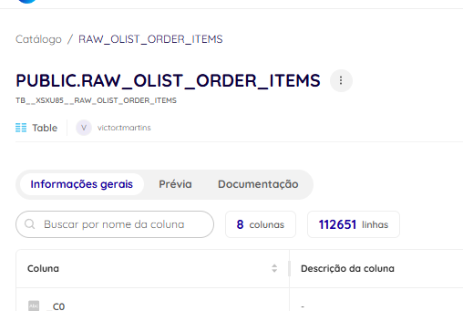
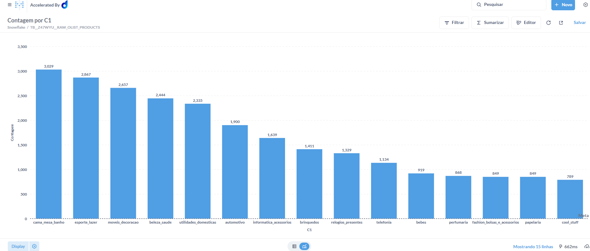
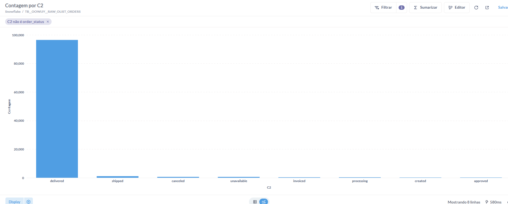
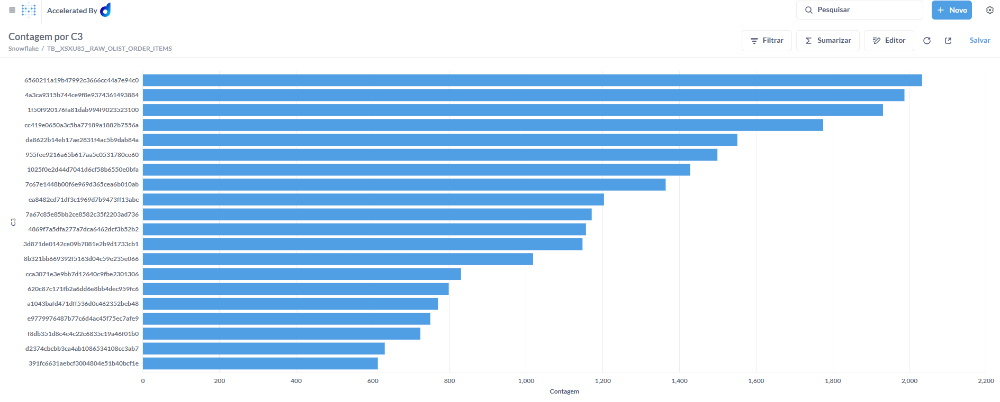
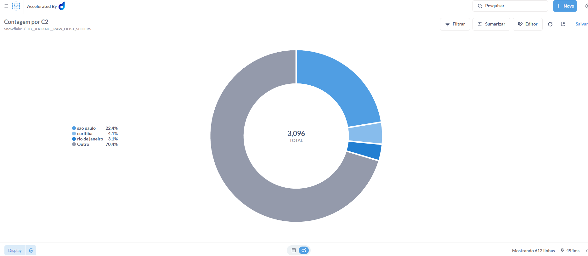
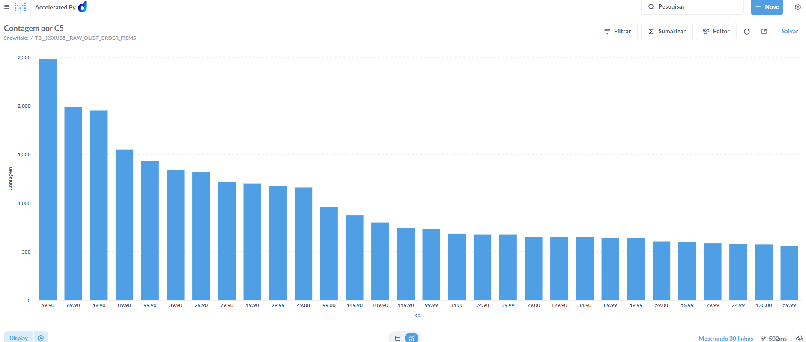
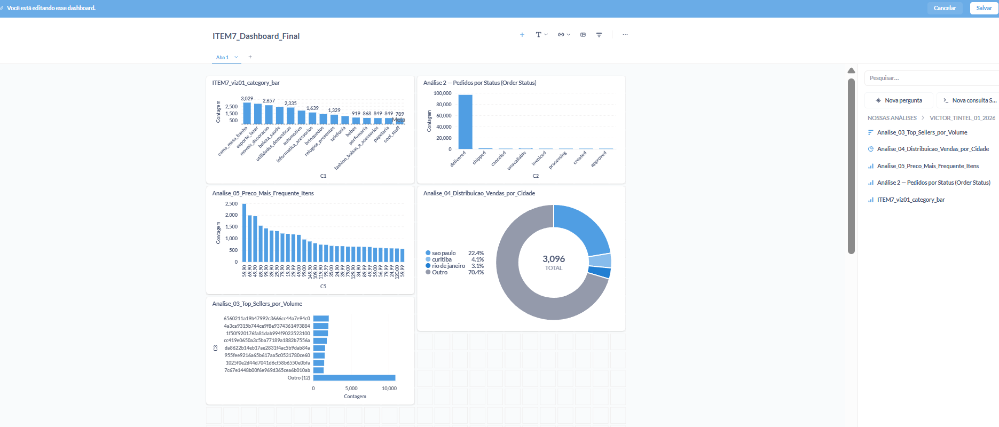

# Item 7 — Dadosfera: Análise de Dados (Dashboards)

## 7.1 Objetivo
Construir análises e visualizações no módulo de **Visualização** da Dadosfera, criando:
- uma **Collection** para organizar os artefatos;
- **5 análises** com **tipos de gráficos diferentes**;
- um **dashboard final** contendo obrigatoriamente:
  - uma análise por **categoria**;
  - uma análise de **série temporal**;
- evidências via prints e registro da **query SQL** utilizada (quando aplicável).

---

## 7.2 Collection criada
A collection foi criada no módulo **Analisar → Visualização** para armazenar todas as análises e o dashboard.

**Evidência:**
- `assets/prints/ITEM7_collection_created.png`

---

## 7.3 Datasets utilizados
Foram utilizados datasets transacionais do Olist (raw) e o dataset de features semânticas (stg) gerado no Item 5.

### Datasets (Catálogo Dadosfera)
- `raw_olist_order_items` — [LINK_AQUI](https://app.dadosfera.ai/pt-BR/catalog/data-assets/ef9944b5-b721-43e3-8b4c-7ce6f5503ca7)  
- `raw_olist_orders` — [LINK_AQUI](https://app.dadosfera.ai/pt-BR/catalog/data-assets/74826053-b2dd-4750-8532-cea1b112024d)  

> Observação: o dataset `raw_olist_order_items` é a base principal para análises de valores e volume (>= 100k registros).  

**Evidência (busca por ID no Visualização):**
- `assets/prints/ITEM7_dataset_by_id.png`

---

## 7.4 Análises criadas 

### Análise 01 — Categoria (Bar Chart)
**Pergunta:** Quais categorias concentram maior volume (ou distribuição) no dataset analisado?  
**Objetivo:** fornecer uma visão por categoria (requisito do item).

**Tipo:** Bar chart  
**Evidência:**
- `assets/prints/ITEM7_viz01_category_bar.png`

---

### Análise 02 — Distribuição por status (bar chart)
**Pergunta:** Qual é a distribuição do volume de pedidos por status (order_status)?

**Objetivo:** Entender o funil operacional do e-commerce: quantos pedidos estão entregues vs. em andamento vs. cancelados.

**Dataset:** olist_orders_dataset
 **Evidência:**
- `assets/prints/ITEM7_viz02_time_line.png`

---

### Análise 03 — Top sellers por volume de itens (Bar chart)
**Pergunta:** Quais sellers concentram mais itens vendidos no dataset?  
**Objetivo:** identificar concentração de volume em poucos sellers (distribuição com cauda longa).

  
**Evidência:**
- `assets/prints/ITEM7_viz03_top_sellers_volume.png`

---

### Análise 04 — Distribuição por cidade (Donut / Pie)
**Pergunta:** Quais cidades concentram maior volume no dataset (Top cidades)?
**Objetivo:** visualizar concentração geográfica e participação relativa das principais cidades vs “Outros”.

**Evidência:**
- `assets/prints/ITEM7_viz04_pie_top_cidades_vendas.png`

---

### Análise 05 — Preço mais frequente (Bar chart)
**Pergunta:** Qual faixa/valor de preço aparece com maior frequência nos itens vendidos?
**Objetivo:** identificar o preço “mais comum” (ponto de concentração) e observar distribuição de preços.

**Dataset:** olist_order_items_dataset   
**Evidência:**
- `assets/prints/ITEM7_viz05_bar_preco_mais_frequente.png`

---

## 7.5 Dashboard final (categoria + série temporal)
Foi criado um dashboard consolidado contendo:
- análise por **categoria** (Análise 01);
- análise **temporal** (Análise 02);
- (opcional) outras visualizações complementares para enriquecer o painel.

**Evidência:**
- `assets/prints/ITEM7_dashboard_final.png`

---

## 7.6 Conclusão
O Item 7 foi concluído com:
- Collection criada;
- dataset encontrado via ID no módulo Visualização;
- 5 análises com 5 tipos de visualizações diferentes;
- dashboard final contendo análises obrigatórias (categoria e série temporal);
- evidências via prints e query SQL registrada.
